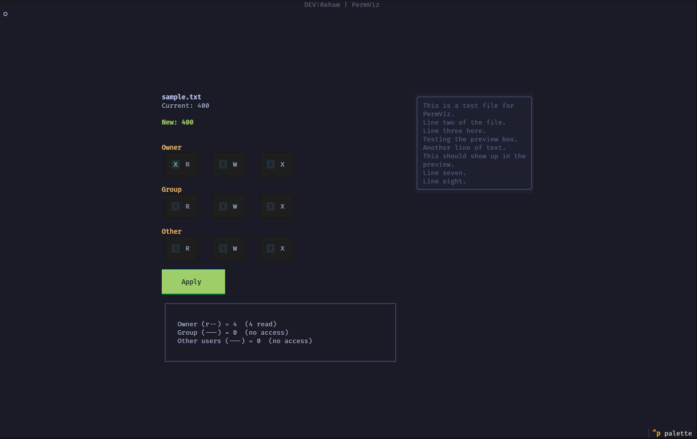

# PermViz

A terminal-based tool for viewing and editing Linux file permissions through an interactive text user interface (TUI).



## What is PermViz

PermViz is a Python application that lets you visualize and modify file permissions on Linux systems using a simple checkbox-based interface. Instead of memorizing chmod commands and octal numbers, you can toggle permissions on and off and see the result in real time.

## Features

- Interactive checkboxes for Owner, Group, and Other permissions (Read, Write, Execute)
- Live octal display that updates as you toggle permissions
- Permission breakdown showing the math behind each octal digit (e.g., Owner (rw-) = 6 (4 read + 2 write))
- File content preview for text files
- Warnings for dangerous permission combinations
- Tokyo Night color theme
- Automatic dependency installation on systems with pip

## Why use PermViz

- You do not need to remember chmod octal codes
- You can see exactly what each permission bit does before applying changes
- The tool warns you before you set dangerous permissions like world-writable executables
- It works as a learning tool for understanding Linux permissions

## Requirements

- Python 3.8 or higher
- pip (for automatic textual installation)

## Installation

1. Clone the repository:

```
git clone https://github.com/PzN2s/PermViz.git
cd permviz
```

2. Install Python 3 and pip if not already installed:

Ubuntu/Debian:
```
sudo apt update && sudo apt install python3 python3-pip
```

Fedora:
```
sudo dnf install python3 python3-pip
```

Arch:
```
sudo pacman -S python python-pip
```

3. Install textual (the only dependency):

```
pip install -r requirements.txt
```

Or directly:
```
pip install textual
```

The app will also try to install textual automatically on first run if it is missing.

## Usage

```
python3 main.py <filepath>
```

Example:
```
python3 main.py sample.txt
```

Or any file:
```
python3 main.py /etc/passwd
sudo python3 main.py /var/log/syslog
```

### NixOS

If you are on NixOS, use the provided shell.nix:

```
nix-shell
python3 main.py <filepath>
```

## Supported Distributions

PermViz works on any Linux distribution that has Python 3 installed:

| Distribution    | Package Manager | Install Command                    |
|----------------|-----------------|------------------------------------|
| Ubuntu/Debian  | apt             | sudo apt install python3-pip       |
| Fedora/RHEL    | dnf             | sudo dnf install python3-pip       |
| Arch/Manjaro   | pacman          | sudo pacman -S python-pip          |
| Alpine         | apk             | apk add python3 py3-pip            |
| openSUSE       | zypper          | sudo zypper install python3-pip    |
| Gentoo         | emerge          | sudo emerge dev-python/pip         |
| NixOS          | nix             | use nix-shell or nix-env           |

The tool itself only uses Python standard library modules (os, stat, subprocess, sys) which are available on every Linux system. The only external dependency is `textual`, which is installed automatically if pip is available.

## Project Structure

```
permviz/
  main.py           # Main application code
  requirements.txt  # Python dependencies
  shell.nix         # NixOS environment
  imsage.png        # Screenshot
  sample.txt        # Sample file for testing
```

## How it works

1. The app reads the current permissions of the specified file using `os.stat()`
2. It converts the permission bits into individual checkboxes for Owner, Group, and Other
3. As you toggle checkboxes, the octal display and permission explanation update in real time
4. Clicking Apply writes the new permissions using `os.chmod()`
5. Warnings appear for risky configurations like removing owner read access or allowing world-write on executables

## License

MIT
